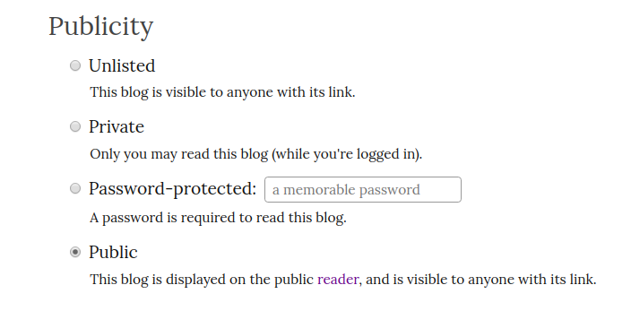

Blogging
========

One of the most effective ways to get a grasp on a new topic, is to write more and more
about it.

To answer the question - *"Why Blog?"*, read this awesome guide - `here
<https://summertraining.readthedocs.io/en/latest/blogging.html>`_.

Writing blogs is highly encouraged. At AMU-OSS, we follow the practice of writing
blog posts about what you've learnt in the weekly online sessions.

We encourage the habit of writing frequently, and on anything of your interest.

AMU-OSS blogs are hosted at https://blogs.amuoss.tk.

Below are the steps you need to perform in order to get started.

Request an invite link
----------------------

To get an invite link, ping `Rahul Jha [:RJ722] <https://rj722.github.io>`_ on Slack,
requesting for an invite link.

After you've received the link, open it to register yourself on https://blogs.amuoss.tk
with your email (so that you don't get locked out when you forget your password).

Configure your blog space
-------------------------

Make your blog visible to everyone
^^^^^^^^^^^^^^^^^^^^^^^^^^^^^^^^^^

By default, all the posts you write are stored as drafts in your blog.
To make them public, follow these steps -
 - navigate to `your blog <https://blogs.amuoss.tk/me/c/>`_
 - open the `customize <https://blogs.amuoss.tk/me/c/roshan>`_ link. This opens up your blog settings page.
 - Under the *Publicity* section, change *Private* to **Public**.

Move a drafted post to your blog
^^^^^^^^^^^^^^^^^^^^^^^^^^^^^^^^

If you posted something, and it doesn't appear on your blog, check to see if
it was stored as a draft.

Open the `drafts <https://blogs.amuoss.tk/me/posts/>`_
page, and click "*move to (your_username)*" to make it public.

However, we recommend changing the blog settings to *Public* to prevent this from
happening by default.

View blogs on the Reader
------------------------

When you publish something (or make it public), it takes time for the post to show
up publicly. Wait for a few minutes, and refresh the page to see if your post appears
on `the reader <https://blogs.amuoss.tk/read>`_.

You're all set up!
------------------

Now that you're successfully set up for blogging, you might want to
start by looking at what others have written. Give a read to some of
them on our `reader <https://blogs.amuoss.tk/read>`_.

Go ahead, write some good stuff!
