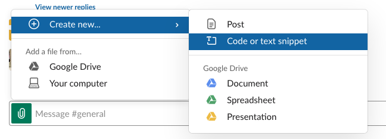
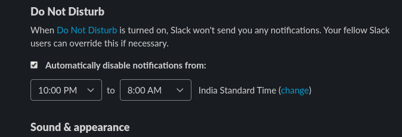
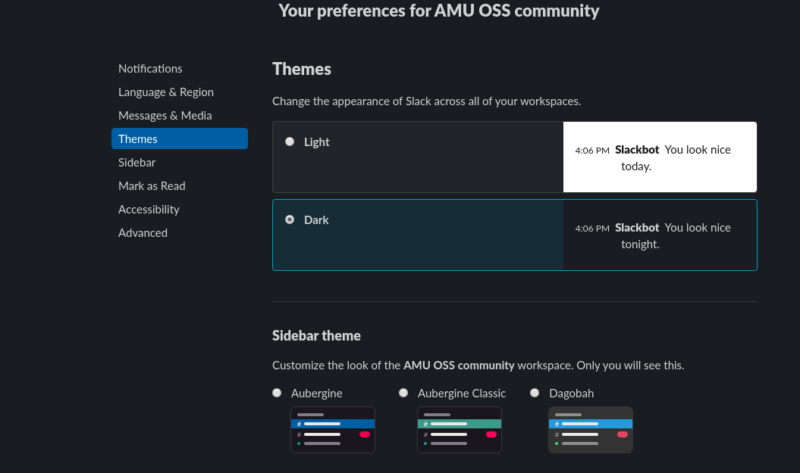

Slack
=====

.. _how-to-join:

How to join Slack?
------------------

Just enter your email address at https://slack-invite-automated.herokuapp.com/
and follow the instructions in the email.

The first thing you should do after joining Slack is introduce yourself in the
*#introduction* channel. It doesn't have to be an essay (although, we'd love to
know as much as you can tell). It can simply be a couple of lines stating your
name, what are your interests, how you came to know about us, etc.

.. TODO: Add a section about How to use Slack effectively (send a message whenever you
.. come online, strike a conversation when you join)

.. _how-to-talk:

How to talk on Slack channel?
-----------------------------

DISCLAIMER: The rules we have here may appear quirky and intimidating to you,
but these are necessary to ensure that everyone in the group learns how to
actually talk in a professional environment. These are the things which are
never taught in school.

Write complete English words
^^^^^^^^^^^^^^^^^^^^^^^^^^^^

Write complete English words only. Don't ever use words like *'K', 'Thanxx', 'u'*
- it's looked down upon.

We've also noticed people using '...' to end their sentences. We do not quite
understand why someone would do so, but we recommend against it. It looks
unprofessional and makes an impression on the reader that the speaker is missing
something. (ellipsis - '...' - are generally used to denote infinity)

English is not the native language for the most of us, so it's fine if there are
grammatical errors in writing. But, you should always check for spelling
mistakes (using an automated spell checker) before hitting enter.

Lists of Acronyms allowed
^^^^^^^^^^^^^^^^^^^^^^^^^

Given the popular use of these terms in the hacker space, we allow the use of
following:

* **AFK** - Away From Keyboard
* **AFAIK** - As Far As I Know
* **FWIW** - For What It's Worth
* **FWIR** - From What I Recall

Sharing Code Snippets on Slack
^^^^^^^^^^^^^^^^^^^^^^^^^^^^^^

Since, code snippets can get really long, it is not advised to type in code
directly as a message.

Instead you can either share code as media on Slack (see screenshot below), or
upload your code to paste service like paste.debian.net or gist.github.com and
then share a link with us.

Do not assume pronouns of people
^^^^^^^^^^^^^^^^^^^^^^^^^^^^^^^^

Do not try to assume which pronoun to use while talking to someone. It is much
nicer if you use gender neutral words (or the names) in any type of
communication. This guide has more details which one should read.

Adjust notification time for Slack
^^^^^^^^^^^^^^^^^^^^^^^^^^^^^^^^^^

By default, Slack automatically turns off notifications after 10 PM.

To avoid missing out on any notifications after that, extend the default
notification time according to your sleeping schedule.

For changing, reach out to *Preferences* > *Notifications* > *Do Not Disturb*.
and set your notification time frame. 

Try out the dark theme
^^^^^^^^^^^^^^^^^^^^^^

Slack offers a dark theme as well, which is much more pleasant and comfortable
for your eyes.

To turn in on, head over to *Preferences* > *Themes* > *Dark*.

Be nice to everyone
^^^^^^^^^^^^^^^^^^^

The most important point to start this guide, always be nice to everyone over
Internet. Do not use any improper words, or attack people. Everyone has their
own view point, and own opinion. That may not be the same of yours, but that
should not be the reason to start a heated argument over chat/meeting/mailing
list. People are opinionated, to solve some complex problem people will try to
force their ideas to everyone. But, the language should always remain civil.

The above two paragraph's have been taken from `dgplug's summertraining guide
<https://summertraining.readthedocs.io/en/latest/commguidelines.html>`_.

`Here <https://dgplug.org/irclogs/mbuf_1stclass.log>`_ is a session from `Shakti
Kannan <www.shakthimaan.com>`_  which has further details on how one should
communicate professionally.
